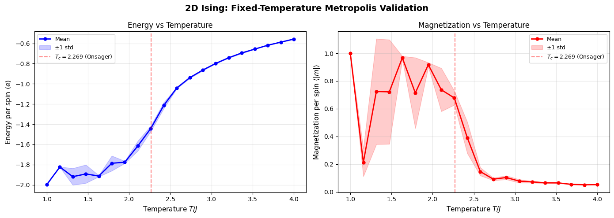
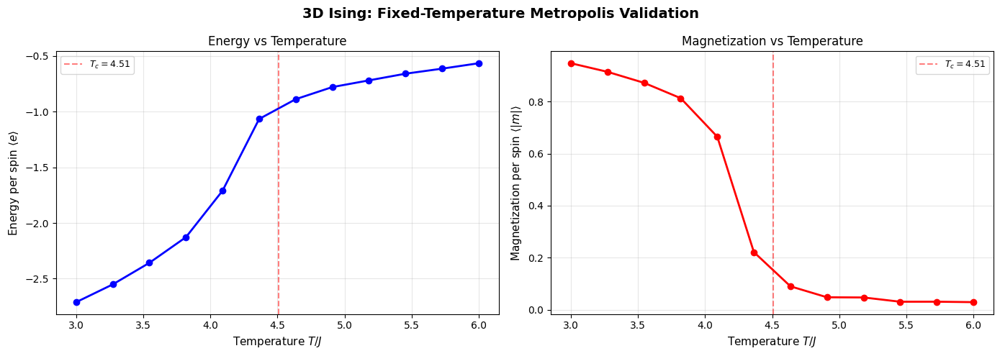
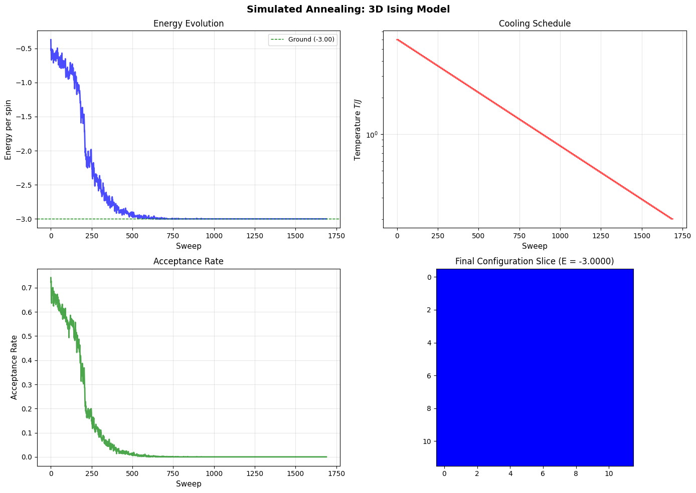

> **Note:** The math behind the acceptance rule and cooling is in the companion post: [Simulated Annealing: From Physics to Optimization](/simulated-annealing-theory/).

## Project Overview

I wanted something I could **run** and **break**: the Ising model is small enough to fit in a notebook, messy enough to feel real. Here is a brief summary of the project.

First we run **Metropolis** at a **fixed temperature** and see if the transition sits near the known **`$T_c$`**. If that fails, we have a problem.

Then we cool with **simulated annealing** on a **3D** lattice and hunt for a **low-energy** state. In 2D we have **Onsager’s number** to compare against; in 3D we mostly have **numerics**: so we lean on the code and the plots.

Along the way: **local** `$\Delta E$` **updates**, **periodic boundaries**, and the same acceptance rule as in the theory post.

---

## 1. The Ising Model: Quick Review

### The Hamiltonian (Energy Function)

For a system of spins `$\mathbf{s} = \{s_1, s_2, \ldots, s_N\}$` where each `$s_i \in \{-1, +1\}$`, the **Ising Hamiltonian** is:

```
E(\mathbf{s}) = -J \sum_{\langle i,j \rangle} s_i s_j
```

**Key components:**
- **`$J > 0$`**: Coupling constant (ferromagnetic: spins want to align)
- **`$\langle i,j \rangle$`**: Sum over nearest neighbors only
  - 2D: 4 neighbors per spin
  - 3D: 6 neighbors per spin
- **`$s_i s_j$`**: Interaction term
  - Aligned (`$s_i = s_j$`): contributes `$-J$` (lower energy)
  - Anti-aligned (`$s_i \neq s_j$`): contributes `$+J$` (higher energy)

### Ground State

The **ground state** (minimum energy) is when **all spins are aligned**:
- 2D: `$E_0 = -2JL^2$` (per spin: `$-2J$`)
- 3D: `$E_0 = -3JL^3$` (per spin: `$-3J$`)

That gives us a simple scorecard when we run SA: how close did we get to **all spins aligned**?

### Observables

- **Energy**: `$E = -J \sum_{\langle i,j \rangle} s_i s_j$`
- **Magnetization**: `$M = \sum_i s_i$` (sum of all spins)
- **Energy per spin**: `$e = E / N$`
- **Magnetization per spin**: `$m = M / N$`

### Phase Transitions

- **Below `$T_c$`**: Ordered phase (high magnetization, low energy)
- **At `$T_c$`**: Critical point (phase transition)
- **Above `$T_c$`**: Disordered phase (low magnetization, higher energy)

**Known critical temperatures:**
- **2D**: Exact solution by Onsager (1944) `$T_c / J = 2/\ln(1+\sqrt{2}) \approx 2.269$`
- **3D**: Well-characterized numerically `$T_c / J \approx 4.51$`

### Why the Ising Model Fits This Project

- **We know the bottom** in the ferromagnetic case (aligned spins), so we can tell if annealing helped or fooled us.
- **The landscape is bumpy**: domains and walls mean local minima show up without asking for them.
- **Each move should stay cheap**: updating one spin should not mean resumming the whole lattice (see [§3](#sec-implementation)).

---

## 2. The Critical Temperature (2D)

### Onsager's Exact Solution

The 2D critical temperature is known in closed form (Onsager, 1944):

```
T_c = \frac{2J}{\ln(1 + \sqrt{2})} \approx 2.269 J
```

That value is the reference we use later when we check fixed-temperature Metropolis in 2D.

<details>
  <summary><strong>Deep Dive (Optional): Transfer Matrix and Where `$T_c$` Comes From</strong></summary>

  **Partition function**

  Computing `$Z = \sum_{\{\mathbf{s}\}} e^{-E(\mathbf{s})/T}$` by brute force sums `$2^{L^2}$` terms is not feasible for large `$L$`. The transfer-matrix approach builds `$Z$` **row by row** instead of enumerating the full lattice at once.

  **Transfer matrix**

  For an `$L \times L$` lattice, the transfer matrix `$T$` is `$2^L \times 2^L$`: rows/columns index possible **row** configurations, and `$T[i,j]$` stores the Boltzmann weight for transitioning from row `$i$` to row `$j$`.

  **Trace formula**

  ```
  Z = \text{Tr}(T^N) = \sum_{i=1}^{2^L} \lambda_i^N
  ```

  where `$N$` is the number of rows and `$\lambda_i$` are eigenvalues of `$T$`.

  **Complexity**

  - Direct sum: `$2^{L^2}$` (exponential in area).
  - Transfer-matrix formulation: still exponential in the width `$L$`, but structured enough to attack analytically.

  **Critical point**

  `$T_c$` appears where the largest eigenvalue becomes degenerate (two eigenvalues equal). Carrying that out leads through the **Onsager algebra**: the non-commutative structure you get when the transfer matrix factors into pieces such as `$T = V_1 V_2$` with `$[V_1,V_2]\neq 0$`. That is the algebraic backbone behind the closed form for `$T_c$` in 2D.

</details>

### 3D: No Closed Form

There is **no known closed-form** thermodynamic solution for the standard 3D Ising model comparable to 2D. Practically:

- A transfer-matrix viewpoint blows up (**exponential in cross-sectional area**, not just width).
- Numerics give **`$T_c / J \approx 4.51$`** for the cubic lattice (see references).

So for us, **3D** is the part where we stop quoting closed forms and actually **run** the computational machinery.

---

<span id="sec-implementation" />

## 3. Implementation Details

### 3.1 Fast Energy Calculation

**The Problem**: A **full** energy recomputation is **`$O(N)$`** (each spin only talks to a few neighbors, but you still touch every spin). If you did that after **every** proposed flip in a sweep of `$N$` proposals, a naive sweep would scale like **`$O(N^2)$`**.

**The Solution**: Track only the **local energy change** `$\Delta E$` when flipping a single spin: **`$O(1)$`** work per proposal if you sum neighbors only.

**Derivation**:

When we flip spin `$s_i$`:
- Before: `$E = -J \sum_{\langle i,j \rangle} s_i s_j + \text{(other terms)}$`
- After: `$E' = -J \sum_{\langle i,j \rangle} (-s_i) s_j + \text{(other terms)}$`

The change is:
```
\Delta E = E' - E = -J \sum_{j \in \text{nbrs}(i)} [(-s_i) s_j - s_i s_j] = -J \sum_{j \in \text{nbrs}(i)} [-2 s_i s_j] = 2J s_i \sum_{j \in \text{nbrs}(i)} s_j
```

**Key insight**: Only the neighbors of the flipped spin contribute to the energy change!

**Complexity**: **`$O(1)$`** per accepted/tested flip versus **`$O(N)$`** for a full energy rebuild.

### 3.2 Periodic Boundary Conditions

Fixed boundaries give spins at the edge fewer neighbors than bulk spins. **Periodic boundary conditions** (PBC) remove that artifact by treating the lattice as a **torus**:
- Right edge connects to left edge
- Top edge connects to bottom edge
- In 3D: front connects to back

**Topology**: 2D torus; 3D hypertorus: every site sees the same neighborhood pattern.

**Implementation** (**modulo** indexing):
```python
def get_neighbors(self, i, j, k):
    """PBC: (i+1) % L wraps around"""
    return [
        self.spins[i, (j+1) % self.L, k],      # Right neighbor
        self.spins[i, (j-1) % self.L, k],      # Left neighbor
        self.spins[(i+1) % self.L, j, k],      # Down neighbor
        self.spins[(i-1) % self.L, j, k],      # Up neighbor
        self.spins[i, j, (k+1) % self.L],      # Front neighbor
        self.spins[i, j, (k-1) % self.L]       # Back neighbor
    ]
```

**Example**: For `$L=4$`, spin at position `$(3, 3)$`:
- Right neighbor: `$(3, (3+1) \% 4) = (3, 0)$` ✔ (wraps to left)
- Down neighbor: `$((3+1) \% 4, 3) = (0, 3)$` ✔ (wraps to top)

**Result**: Every spin has exactly the same number of neighbors, regardless of position!

### 3.3 From 2D to 3D: Code Portability

**Key Insight**: The code structure is **nearly identical**: only the neighbor count changes! This makes the code highly portable and easy to extend to higher dimensions.

**Differences**:
- **Array dimensions**: `$(L, L)$` → `$(L, L, L)$`
- **Neighbor count**: 4 neighbors → 6 neighbors
- **Energy per spin**: `$-2J$` → `$-3J$` (more neighbors = lower ground state energy)
- **Critical temperature**: `$T_c \approx 2.27$` → `$T_c \approx 4.51$`

**What stays the same**:
- Hamiltonian form: `$E = -J \sum_{\langle i,j \rangle} s_i s_j$`
- Fast `$\Delta E$` calculation: Same formula, just more neighbors
- PBC implementation: Same modulo operator, just 3 dimensions
- Metropolis algorithm: Identical acceptance rule

---

## 4. Fixed-Temperature Metropolis Validation

### Why Validate First?

Before cooling with SA, run **Metropolis at fixed `$T$`** and check observables near **`$T_c$`**. If the phase transition lands in the wrong place, debugging SA first would waste time.

### What "Fixed Temperature" Means Here

Hold **`$T$` constant** for equilibration plus production sweeps so the chain samples roughly **Boltzmann** at that temperature; repeat across a temperature grid to cross the transition.

### 2D Validation

Runs at fixed **`$T$`** near **`$T_c \approx 2.269$`**:

<details className="code-details">
  <summary><strong>2D validation code</strong> — <code>Ising2D</code>, Metropolis sweep, fixed-<code>T</code> driver</summary>

```python
class Ising2D:
    """2D Ising model with periodic boundary conditions."""
    
    def __init__(self, L, J=1.0, random=True):
        self.L = L
        self.J = J
        self.N = L * L
        
        if random:
            self.spins = np.random.choice([-1, 1], size=(L, L)).astype(np.int8)
        else:
            self.spins = np.ones((L, L), dtype=np.int8)
    
    def get_neighbors(self, i, j):
        """Get 4 neighbors with PBC."""
        return [
            self.spins[i, (j+1) % self.L],  # Right
            self.spins[i, (j-1) % self.L],  # Left
            self.spins[(i+1) % self.L, j],  # Down
            self.spins[(i-1) % self.L, j]   # Up
        ]
    
    def delta_energy(self, i, j):
        """Fast energy change: O(1)."""
        neighbors = self.get_neighbors(i, j)
        sum_neighbors = sum(neighbors)
        return 2 * self.J * self.spins[i, j] * sum_neighbors
    
    def flip_spin(self, i, j):
        """Flip spin at (i, j)."""
        self.spins[i, j] *= -1
    
    def get_energy(self):
        """Compute total energy."""
        E = 0.0
        for i in range(self.L):
            for j in range(self.L):
                neighbors = self.get_neighbors(i, j)
                E -= self.J * self.spins[i, j] * sum(neighbors)
        return E / 2
    
    def get_energy_per_spin(self):
        return self.get_energy() / self.N
    
    def get_magnetization_per_spin(self):
        return abs(np.sum(self.spins)) / self.N


def metropolis_sweep_2d(ising, T, seed=None):
    """One Metropolis sweep (2D)."""
    if seed is not None:
        np.random.seed(seed)
    
    accepted = 0
    for _ in range(ising.N):
        i = np.random.randint(0, ising.L)
        j = np.random.randint(0, ising.L)
        delta_E = ising.delta_energy(i, j)
        if delta_E < 0 or np.random.random() < np.exp(-delta_E / T):
            ising.flip_spin(i, j)
            accepted += 1
    return accepted / ising.N


def run_fixed_T_2d(ising, T, n_sweeps, n_equil=100, seed=None):
    """Run Metropolis at fixed temperature T (2D)."""
    if seed is not None:
        np.random.seed(seed)
    
    # Equilibration
    for _ in range(n_equil):
        metropolis_sweep_2d(ising, T)
    
    # Production
    energies = []
    magnetizations = []
    for _ in range(n_sweeps):
        metropolis_sweep_2d(ising, T)
        energies.append(ising.get_energy_per_spin())
        magnetizations.append(ising.get_magnetization_per_spin())
    
    return {
        'energies': np.array(energies),
        'magnetizations': np.array(magnetizations)
    }
```

</details>

**Output:**



The curves line up with **Onsager’s `$T_c$`**: ordered side below `$T_c$`, disordered above, smooth energy crossing.

### 3D Validation

Same pipeline at **`$T_c \approx 4.51$`**. Code (full 3D lattice class):

<details className="code-details">
  <summary><strong>3D validation code</strong> — <code>Ising3D</code>, Metropolis sweep, fixed-<code>T</code> driver</summary>

```python
import numpy as np
import matplotlib.pyplot as plt
from matplotlib.colors import ListedColormap
from tqdm import tqdm

class Ising3D:
    """3D Ising model with periodic boundary conditions."""
    
    def __init__(self, L, J=1.0, random=True):
        """Initialize 3D Ising lattice.
        
        Args:
            L: Linear size (L×L×L lattice)
            J: Coupling constant
            random: If True, random spins; if False, all +1 (ground state)
        """
        self.L = L
        self.J = J
        self.N = L * L * L  # Total number of spins
        
        # Initialize spins: 3D array of ±1
        if random:
            self.spins = np.random.choice([-1, 1], size=(L, L, L)).astype(np.int8)
        else:
            self.spins = np.ones((L, L, L), dtype=np.int8)
    
    def get_neighbors(self, i, j, k):
        """Get 6 neighbors with periodic boundary conditions (PBC).
        
        Uses modulo operator: (i+1) % L automatically wraps around.
        """
        neighbors = []
        # 6 neighbors in 3D: ±x, ±y, ±z
        for di, dj, dk in [(-1,0,0), (1,0,0), (0,-1,0), (0,1,0), (0,0,-1), (0,0,1)]:
            ni = (i + di) % self.L  # PBC: wraps around
            nj = (j + dj) % self.L
            nk = (k + dk) % self.L
            neighbors.append((ni, nj, nk))
        return neighbors
    
    def delta_energy(self, i, j, k):
        """Fast energy change calculation: O(1) instead of O(N).
        
        Only neighbors contribute to energy change when flipping one spin.
        Formula: ΔE = 2J s_i Σ_j s_j (sum over neighbors)
        """
        neighbors = self.get_neighbors(i, j, k)
        sum_neighbors = sum(self.spins[ni, nj, nk] for ni, nj, nk in neighbors)
        return 2 * self.J * self.spins[i, j, k] * sum_neighbors
    
    def flip_spin(self, i, j, k):
        """Flip spin at position (i, j, k)."""
        self.spins[i, j, k] *= -1
    
    def get_energy(self):
        """Compute total energy (slow, for verification)."""
        E = 0.0
        for i in range(self.L):
            for j in range(self.L):
                for k in range(self.L):
                    neighbors = self.get_neighbors(i, j, k)
                    for ni, nj, nk in neighbors:
                        E -= self.J * self.spins[i, j, k] * self.spins[ni, nj, nk]
        return E / 2  # Divide by 2 to avoid double counting
    
    def get_energy_per_spin(self):
        """Get energy per spin."""
        return self.get_energy() / self.N
    
    def get_magnetization_per_spin(self):
        """Get magnetization per spin."""
        return np.sum(self.spins) / self.N
    
    def visualize_slice(self, axis=2, slice_idx=None, ax=None):
        """Visualize a 2D slice of the 3D configuration."""
        if slice_idx is None:
            slice_idx = self.L // 2
        
        if ax is None:
            fig, ax = plt.subplots(1, 1, figsize=(8, 8))
        
        # Extract slice
        if axis == 0:
            slice_data = self.spins[slice_idx, :, :]
        elif axis == 1:
            slice_data = self.spins[:, slice_idx, :]
        else:
            slice_data = self.spins[:, :, slice_idx]
        
        cmap = ListedColormap(['blue', 'red'])
        im = ax.imshow(slice_data, cmap=cmap, vmin=-1, vmax=1)
        ax.set_title(f'3D Ising Slice (axis={axis}, slice={slice_idx})', fontsize=11)
        return ax


def metropolis_sweep_3d(ising, T, seed=None):
    """Perform one Metropolis sweep at temperature T (3D version).
    
    One sweep = N proposed spin flips (one per spin, in random order).
    """
    if seed is not None:
        np.random.seed(seed)
    
    accepted = 0
    
    # Propose N flips (one sweep)
    for _ in range(ising.N):
        # Random spin
        i = np.random.randint(0, ising.L)
        j = np.random.randint(0, ising.L)
        k = np.random.randint(0, ising.L)
        
        # Fast energy change calculation
        delta_E = ising.delta_energy(i, j, k)
        
        # Metropolis acceptance
        if delta_E < 0 or np.random.random() < np.exp(-delta_E / T):
            ising.flip_spin(i, j, k)
            accepted += 1
    
    return accepted / ising.N

def run_fixed_T_3d(ising, T, n_sweeps, n_equil=100, seed=None):
    """Run Metropolis at fixed temperature T (3D)."""
    if seed is not None:
        np.random.seed(seed)
    
    # Equilibration
    for _ in range(n_equil):
        metropolis_sweep_3d(ising, T)
    
    # Production
    energies = []
    magnetizations = []
    for _ in range(n_sweeps):
        metropolis_sweep_3d(ising, T)
        energies.append(ising.get_energy_per_spin())
        magnetizations.append(abs(ising.get_magnetization_per_spin()))
    
    return {
        'energies': np.array(energies),
        'magnetizations': np.array(magnetizations)
    }
```

</details>

**Output:**



Qualitatively matches 2D; numerically pins **`$T_c$`** where literature says it should be: excellent signal before SA.

---

## 5. Simulated Annealing for 3D Ising

Now we turn the dial: start hot so flips get accepted, then lower **`$T$`** toward **`$T_{\min}$`** and watch energy and acceptance along the way. The goal is a **cheap path** to a **very low** energy: not a proof, just a good final lattice.

### SA Implementation

We'll use a **geometric cooling schedule**: `$T_{k+1} = \alpha T_k$` where `$\alpha = 0.98$` (slow cooling).

<details className="code-details">
  <summary><strong>Simulated annealing code</strong> — geometric schedule + <code>simulated_annealing_3d</code></summary>

```python
class GeometricSchedule:
    """Geometric cooling schedule: T_{k+1} = alpha * T_k"""
    
    def __init__(self, T0, T_min, alpha=0.95):
        self.T0 = T0
        self.T_min = T_min
        self.alpha = alpha
        self.T = T0
        self.k = 0
    
    def get_temperature(self):
        return self.T
    
    def cool(self):
        self.T = max(self.T * self.alpha, self.T_min)
        self.k += 1
    
    def is_done(self):
        return self.T <= self.T_min


def simulated_annealing_3d(ising, schedule, sweeps_per_T=10, seed=None):
    """Run Simulated Annealing on 3D Ising model.
    
    Args:
        ising: Ising3D instance
        schedule: Cooling schedule (GeometricSchedule)
        sweeps_per_T: Number of sweeps at each temperature
        seed: Random seed
    
    Returns:
        Dictionary with history (energies, temperatures, acceptance_rates)
    """
    if seed is not None:
        np.random.seed(seed)
    
    energies = []
    temperatures = []
    acceptance_rates = []
    
    while not schedule.is_done():
        T = schedule.get_temperature()
        
        # Run sweeps at this temperature
        for _ in range(sweeps_per_T):
            acc_rate = metropolis_sweep_3d(ising, T)
            energies.append(ising.get_energy_per_spin())
            temperatures.append(T)
            acceptance_rates.append(acc_rate)
        
        schedule.cool()
    
    return {
        'energies': np.array(energies),
        'temperatures': np.array(temperatures),
        'acceptance_rates': np.array(acceptance_rates)
    }
```

</details>

### Running SA

```python
L = 12  # System size
J = 1.0
T0 = 6.0  # High starting temperature
T_min = 0.2
alpha = 0.98  # Slow cooling
sweeps_per_T = 10

# Ground state energy per spin
E_ground = -3 * J  # All spins aligned in 3D

# Create system
ising = Ising3D(L, J=J, random=True)
E_init = ising.get_energy_per_spin()

# Run SA
schedule = GeometricSchedule(T0, T_min, alpha=alpha)
results = simulated_annealing_3d(ising, schedule, sweeps_per_T=sweeps_per_T, seed=42)

E_final = ising.get_energy_per_spin()
```

**Output:**



### Reading the Run

Energy tends to **drift down** as **`$T$`** drops. Early on the acceptance rate stays **high**: the lattice still explores. Later it gets **picky**, as it should. If you watch slices of the lattice, you can see **little islands** at hot **`$T$`** turn into **big patches** as **`$T$`** falls: same picture as in the theory post, but this time is real data.

---

## 6. Closing

Simulated annealing is still only **Metropolis** with a temperature that **drops**. The difference is we give the system room to **walk around** while **`$T$`** is high, then let it **settle** when **`$T$`** is low.

I did not tune this run to death: other **`$L$`**, **`$\alpha$`**, seeds, and schedules will behave differently. That is fine.

What matters to me is that we used a **simulation** to check the **physics** first: does the transition land near **`$T_c$`** where it should? Once that looked right, we could trust the same machinery in a harder setting (**3D**), where there is no tidy closed form to lean on, and still run simulated annealing as an **optimizer** rather than a guess.

That finishes the loop for me: **theory** in the companion post, **plots** that behave like the textbooks, then **practice** in code.

---

## References

- **Onsager, L.** (1944). Crystal statistics. I. A two-dimensional model with an order-disorder transition. *Physical Review*, 65(3-4), 117-149. — Exact solution for 2D Ising model

- **Binder, K., & Heermann, D. W.** (2010). *Monte Carlo Simulation in Statistical Physics: An Introduction*. Springer. — 3D Ising critical temperature `$T_c / J \approx 4.51$`

- **Kirkpatrick, S., Gelatt, C. D., & Vecchi, M. P.** (1983). Optimization by simulated annealing. *Science*, 220(4598), 671-680. — Original Simulated Annealing paper

- **Metropolis, N., et al.** (1953). Equation of state calculations by fast computing machines. *The Journal of Chemical Physics*, 21(6), 1087-1092. — Original Metropolis algorithm

